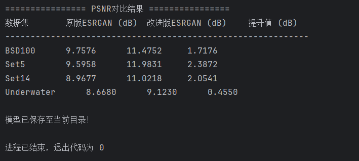
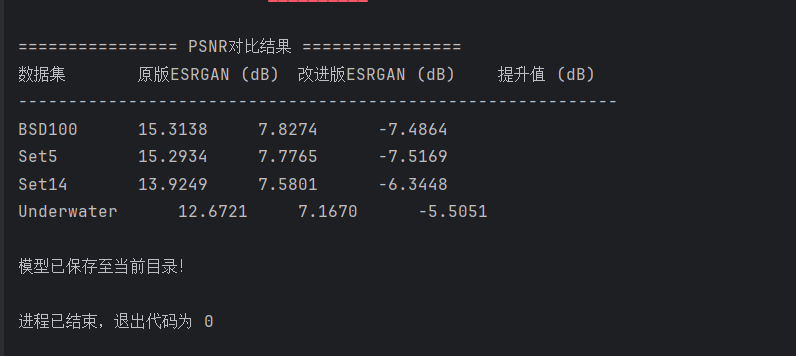

```markdown
# DeepLearning - 智能科学与技术专业 深度学习实验项目

这是一个基于 PyTorch 的深度学习实践仓库，主要聚焦计算机视觉相关任务（如图像处理、超分辨率、模型训练与可视化等）。项目通过模块化设计，便于实验复现与结果展示。




```
```markdown
## 项目结构
DeepLearning├── .idea/                  # PyCharm 项目配置文件（可忽略）
├── models/                 # 模型定义、预训练权重或 checkpoint 保存目录
├── sr_results/             # 实验输出结果（如超分辨率生成的图像、指标日志等）
├── main.py                 # 主程序入口：运行训练、测试、推理等
├── vision.py               # 视觉相关核心模块（数据加载、预处理、模型组件等）
├── visualization.py        # 结果可视化工具（损失曲线、图像对比、指标展示等）
├── 深度学习结果截图.png         # 典型实验结果展示
└── 深度学习新场景应用结果截图.png   # 新应用场景下的结果示例
```

```

## 快速开始

### 环境要求
- Python 3.8+
- PyTorch 2.0+（推荐使用 GPU 版本）
- 其他常见依赖：torchvision, numpy, matplotlib, opencv-python 等

```bash
# 推荐使用虚拟环境
python -m venv venv
source venv/bin/activate   # Linux/macOS
venv\Scripts\activate      # Windows

pip install torch torchvision torchaudio
pip install matplotlib opencv-python numpy
```

### 运行示例
```bash
# 运行主程序（根据 main.py 中的具体实现，可能为训练或推理）
python main.py
```

- 具体功能（如训练模式、测试模式、生成结果）请查看 `main.py` 中的参数配置或注释。
- 结果通常保存在 `sr_results/` 文件夹中。

## 主要功能模块

- **vision.py**：数据管道、数据集类、数据增强、模型构建等。
- **models/**：存放各种网络架构（例如 SRCNN、ESRGAN、自定义 CNN 等）。
- **visualization.py**：绘制训练曲线、PSNR/SSIM 对比图、输入-输出图像并排展示等。
- **sr_results/**：存放生成的超分辨率图像、日志文件等实验产物。

## 实验结果展示

项目包含两张典型结果截图：
- **深度学习结果截图.png**：标准实验对比（低分辨率 → 模型输出 → 高分辨率 ground truth）
- **深度学习新场景应用结果截图.png**：模型在新场景/真实世界图像上的应用效果

## 未来计划 / TODO

- [ ] 添加详细的超参数配置文件（yaml/json）
- [ ] 支持多种超分辨率模型对比实验
- [ ] 集成更多评估指标（LPIPS、NIQE 等）

## 致谢 & 参考

- PyTorch 官方文档与 torchvision
- 经典超分辨率论文与开源实现（如 EDSR, Real-ESRGAN 等）
- 课程/作业来源：深度学习相关实践课程

欢迎 star / fork / issue / PR，一起交流深度学习实验心得！
